# National Grid: Live — Android

A Material 3 (Expressive) Android port of the **National Grid: Live** app — a
live view of Great Britain's electricity generation mix, demand, price and carbon
intensity. It's the Android counterpart to the SwiftUI iOS app, sharing the same
open data sources and the hosted backfill snapshot.

Original dashboard & data model by **Kate Morley** ([grid.iamkate.com](https://grid.iamkate.com/), CC0).

## Design

The iOS app was redesigned around an expandable **Generation card**; this port
keeps that information architecture and re-skins it natively in Material 3:

| Concept | Material 3 treatment |
|---|---|
| Title | Large title as the first scrolling item (scrolls off like a normal layout) |
| Tabs | Bottom **navigation bar** (pill indicator) — Live · Historic · About · Settings |
| Period control | **Segmented buttons** (Past day / week / year / all time) |
| Cards | Tonal `surfaceContainer` cards, 20–28 dp radii |
| Source rows | **List items** — tonal icon badge, thin progress, value / % |
| Expanded group | `surfaceContainerHigh` tonal block |
| Generation chart | Two stacked bars **or** a two-ring donut (inner = categories, outer = fuels) |
| Historic Trends | Compose Canvas line charts — price/emissions/demand + multi-line fuel & interconnector |
| Refresh | Pull-to-refresh + auto-refresh on resume; an offline "Couldn't refresh" banner with Retry |
| Settings | A nav destination (full screen) — Appearance + chart style segmented buttons |

Fuel-mix colours are a **fixed brand palette** (verbatim from Kate's `grid.css`):
they encode the data, so unlike the Material You surface/accent roles they don't
follow the wallpaper. Dynamic colour can be enabled in `NationalGridLiveTheme`.

### Mockups

| Live | Historic | About | Live · dark |
|---|---|---|---|
| 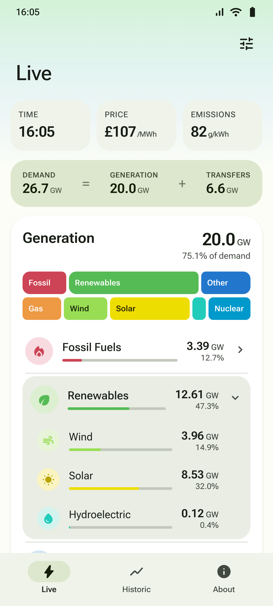 | 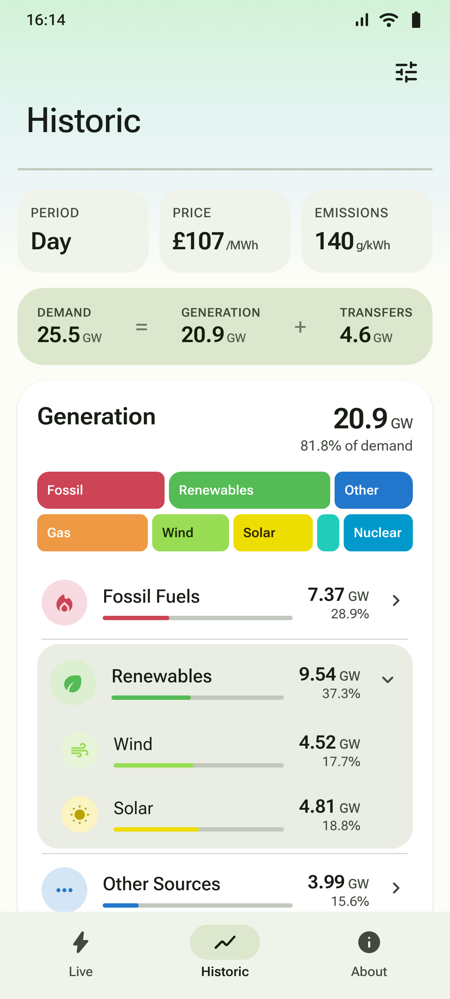 | 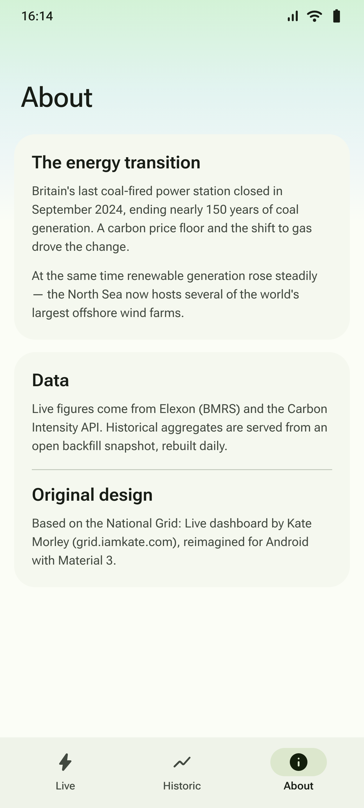 | 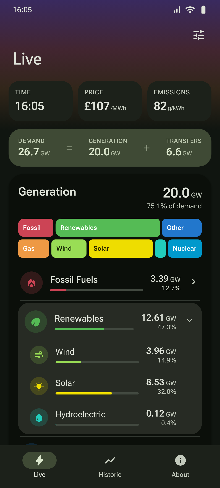 |

These were rendered from the HTML/CSS concepts in [`docs/mockups/`](docs/mockups);
every element maps 1:1 to a composable in `app/src/main/.../ui`.

### Running on a device (live data)

| Live (real-time) | Past day (24h) | Past week (7d) | Past year (snapshot) |
|---|---|---|---|
| 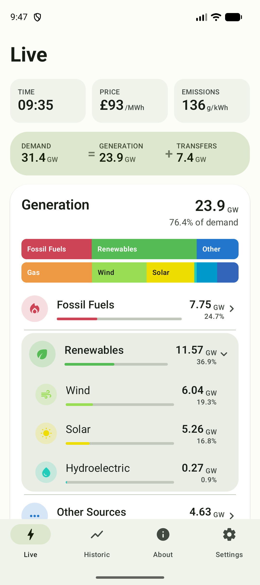 | 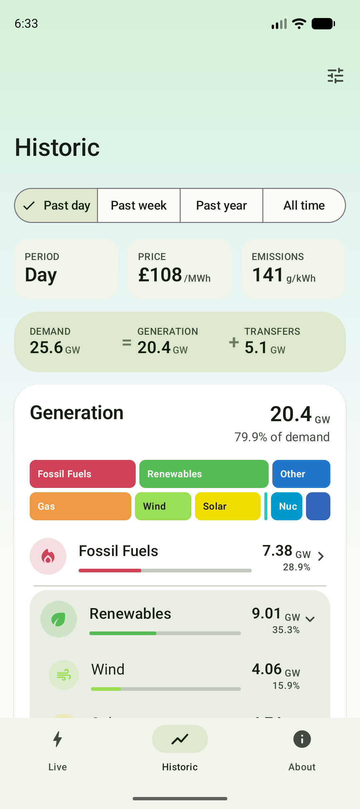 | 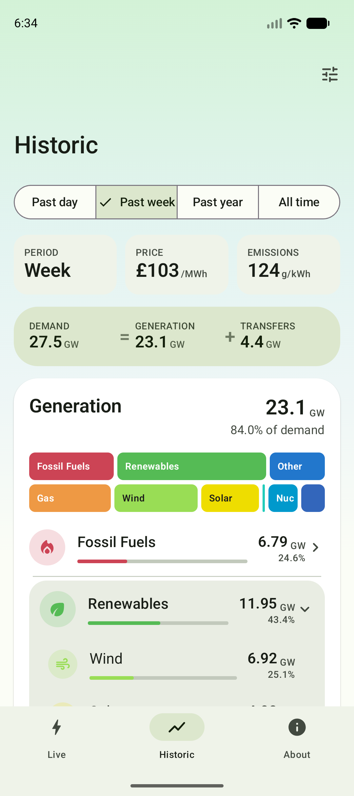 | 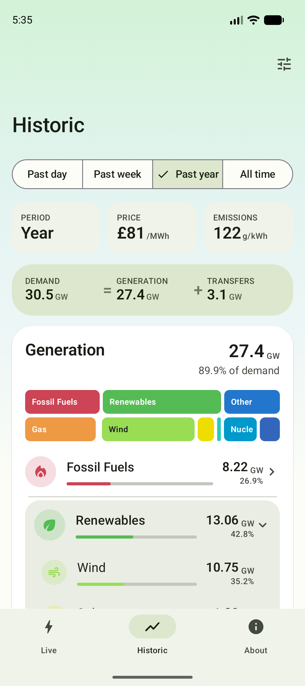 |

| Donut chart | Interconnectors + Storage | Trends charts | About | Settings | Dark theme |
|---|---|---|---|---|---|
| 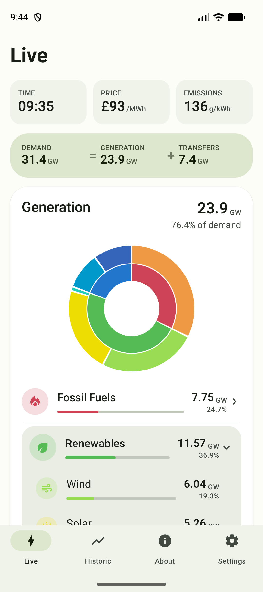 | 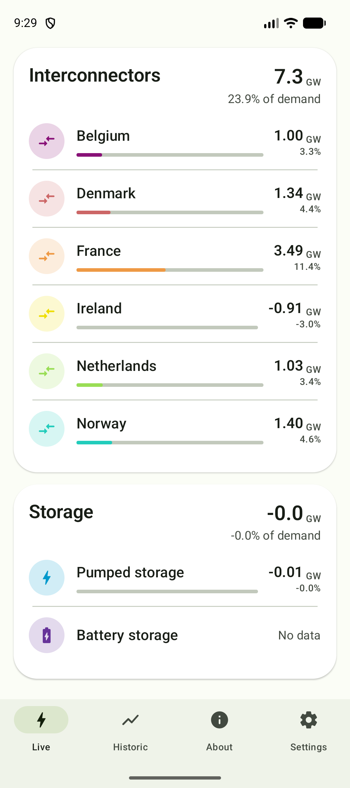 | 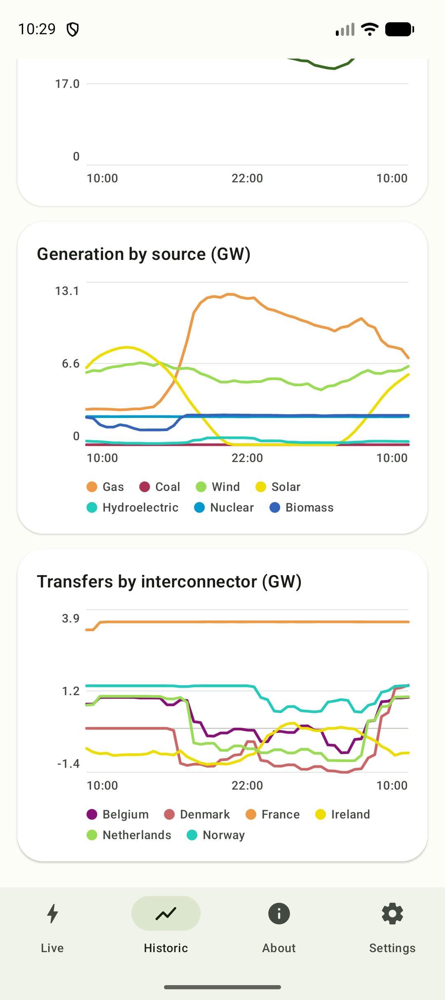 | 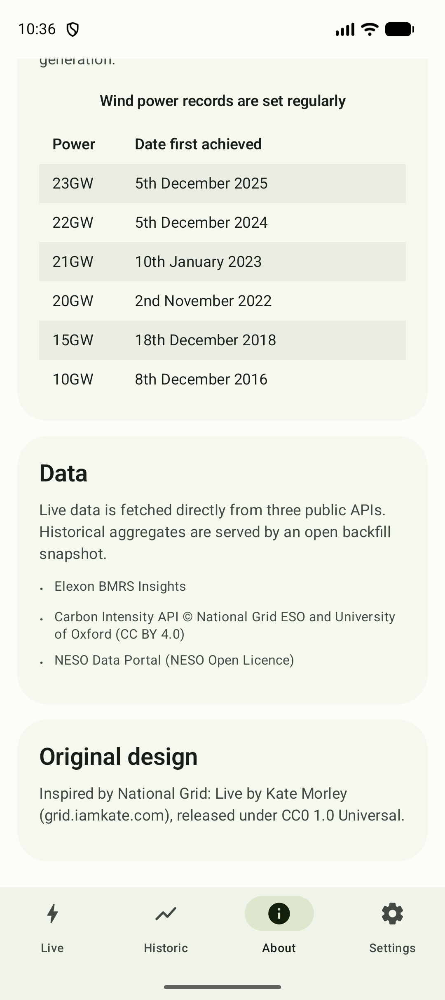 | 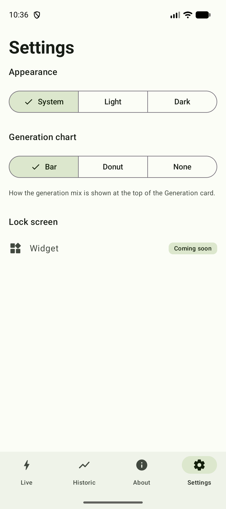 | 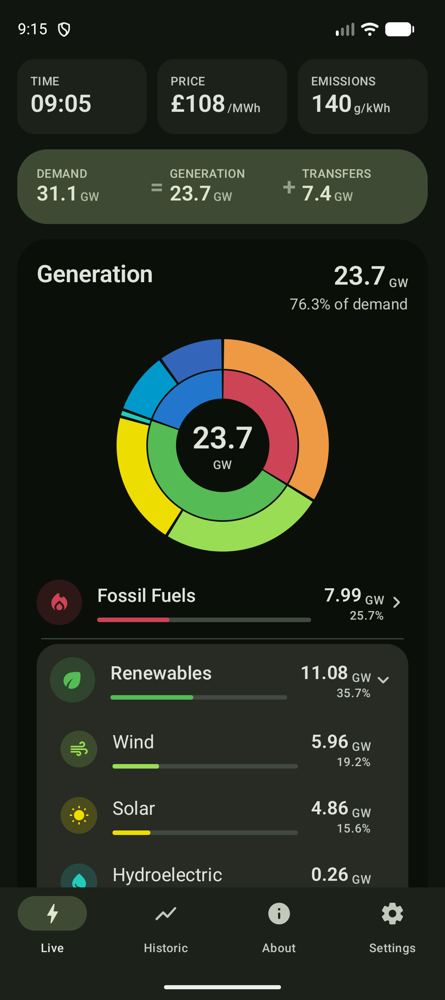 |

All four Historic periods are real: **day/week** are 24h/7d windowed aggregates of
the live APIs; **year/all-time** come from the hosted snapshot (matches
grid.iamkate.com within ~0.3 GW). Live uses NESO embedded solar/wind.

## Tech

- **Kotlin + Jetpack Compose**, Material 3 (`material3` 1.3.x)
- `NavHost` + Navigation Bar, ViewModel + `StateFlow`, OkHttp + kotlinx.serialization
- AGP 8.7.3 · Kotlin 2.0.21 · Compose BOM 2024.10.01 · Gradle 8.10.2
- `minSdk 26`, `targetSdk 35`; adaptive launcher icon incl. a themed (monochrome) layer

```
app/src/main/java/com/crainiate/nationalgridlive/
├── MainActivity.kt                 edge-to-edge host
├── data/
│   ├── model/                      FuelType, FuelCategory, Interconnector, GridSnapshot, GridTimeSeries, Period
│   ├── remote/                     Endpoints, Http, ApiTime, FuelCodeMap, GridApiClient,
│   │                               NesoEmbeddedService, LiveDataAggregator, Snapshot{Service,Parser}
│   ├── cache/                      LiveDataStore (7-day rolling) + LiveDataCache (JSON file)
│   ├── settings/                   AppTheme/GenerationVisualisation + SettingsRepository
│   └── repository/                 GridRepository + Mock / Remote + DataModule
└── ui/
    ├── theme/                      Material You scheme, fuel palette, wash brushes
    ├── components/                 StatCards, DemandCard, GenerationBars/Donut/Card, SourceRow,
    │                               SourceListCard (Interconnectors + Storage), Charts (Trends), PeriodSelector
    ├── live / historic / about     screens + ViewModels
    ├── SettingsSheet.kt            Appearance + chart-style bottom sheet
    └── NationalGridApp.kt          Scaffold + nav + top app bar + wash
```

## Data

Same backend as iOS — no API keys. `RemoteGridRepository` is the default:

- **Live + Past day + Past week** — composed by `LiveDataAggregator` (ported from
  the iOS app) from an **incremental, on-disk 7-day rolling cache** (`LiveDataStore`,
  `filesDir/live-store.json`):
  - sources: Elexon **FUELINST** (5-min, absolute GW per fuel + interconnectors),
    **NESO embedded** solar/wind (30-min), **Carbon Intensity** (30-min emissions),
    Elexon **market-index** (30-min price).
  - each refresh fetches only **`[lastBucket, now]`** and merges the deltas, trimming
    to 7 days — so the only sizeable fetch is the first-launch FUELINST window
    (**capped at 24h**, never the whole week). The on-disk cache is ~150 KB.
  - **Live** = latest 5-min slot + matching 30-min buckets (the iOS "current" anchor
    rules). **Day/Week** = mean of the cached buckets over 24h / 7d.
  - first launch seeds 24h of generation + 7 days of the cheap 30-min sources;
    the week's generation fills to a true 7-day mean as the app is used.
- **Past year / All time** — the hosted backfill snapshot, rebuilt daily, parsed by
  `SnapshotParser` (period means): `…/national-grid-live-tools/v1/snapshot.json`.
  Past-year matches grid.iamkate.com within ~0.3 GW (gen 27.4, gas 8.22, wind 10.75).

Refreshes are de-duplicated across tabs (≤ one network refresh per ~4 min). Every
path falls back to `MockGridRepository` on a network error, so the UI always has
data. Set `DataModule` to `MockGridRepository()` for fully offline, deterministic data.

> **Embedded solar/wind:** FUELINST has no solar and only transmission-level wind,
> so — like the iOS app — `wind = FUELINST WIND + NESO embedded wind` and
> `solar = NESO embedded solar` (rolling `demanddataupdate.csv`, settlement periods
> in local UK time). If NESO is unavailable, live solar falls back to a Carbon
> Intensity mix estimate.

## Settings

A `tune` action opens a Material 3 bottom sheet (`SettingsSheet`), persisted via
`SettingsRepository` (SharedPreferences):
- **Appearance** — System / Light / Dark (drives `NationalGridLiveTheme`; the colour
  wash follows the effective theme — green in light, dusk in dark).
- **Generation chart** — Bar / Donut / None (the card's graphic).

## Build

Needs the Android SDK (platform 35) and a JDK 17+ (Android Studio's bundled JBR works).

```bash
# from a terminal
export JAVA_HOME="/Applications/Android Studio.app/Contents/jbr/Contents/Home"
export ANDROID_HOME="$HOME/Library/Android/sdk"
./gradlew :app:assembleDebug      # APK
./gradlew test                    # unit tests
```

Or just open the folder in **Android Studio** and Run. `@Preview`s in
`ui/preview/Previews.kt` render the Live screen (light + dark) in the IDE.

## License

[MIT](LICENSE) for the source. Aggregated data remains © its providers —
Elexon (BMRS), National Grid ESO & University of Oxford (Carbon Intensity,
CC BY 4.0), NESO (Open Licence).
